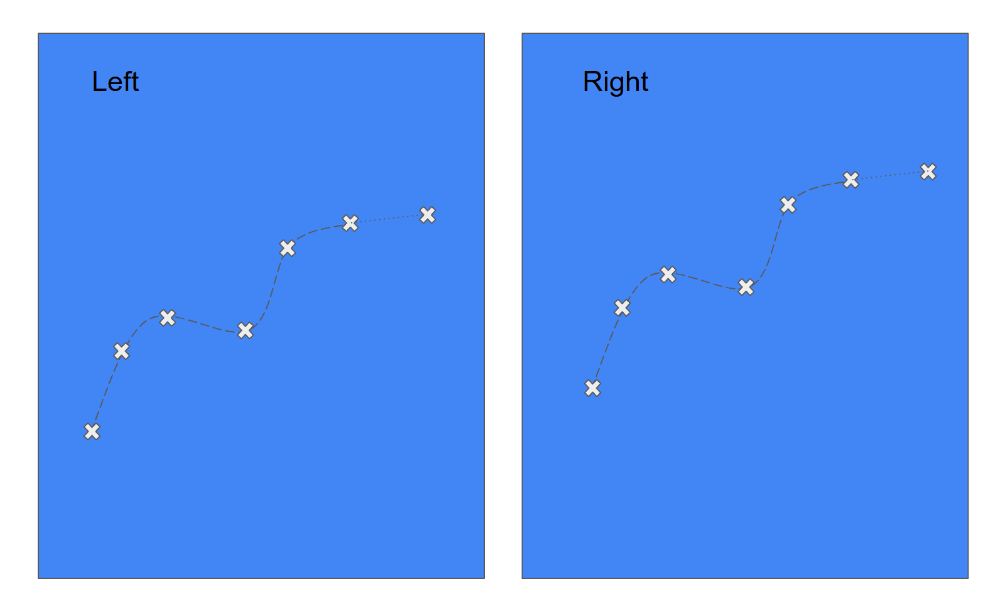

# TrajectoryCase
Underwater optical delousing offers many challenges.
We would like to introduce you to one of them.

Whenever we choose to fire at a sea louse there is a time delay from when the image was taken to when we are ready to fire.
The delay is introduced by several different parts of the vision chain like transferring the image from the camera to the processing unit or doing image processing tasks.
This means that we constantly need to predict where the target is moving in order to hit the correct coordinate at the time of shooting.

We offer you almost 38 000 trajectories sampled from our laser nodes.
Each trajectory point is a 4-dimensional image coordinate from our stereo camera system (`x-left, y-left, x-right, y-right`)

Your task is to make an algorithm that predicts the stereo coordinate for the next frame.

## Some information
1. Each frame is taken at a fixed interval so you can skip the time component.
2. Your algorithm doesn't have to predict until it has received 3 points, but you can of course use all previous points when making a prediction.
3. The algorithm should be able to predict the next point after it has received the third point. 
4. The frame number is zero-indexed so the first element means frame 0.
5. We expect your program to run in under 3 minutes on 40 000 trajectories. 
   If you're training a model etc it's only the inference part that has this time constraint.
6. This is a good oppurtunity for you to show your skills. E.g if you applied for the Node Team (ROV) position it would be nice if at least parts of your solution is written in C++.
   Likewise, if you applied for the app team parts of your solution should be in C# or Javascript and if you applied for the ML team parts of your solution should be in Python. 
7. During the interview we will go through your solution and you will get the chance to explain your code and justify your choices.
   We will send you an evaluation file on the same format as the `samples.csv` file.
   You will then run your program on this file and produce an output file on the format explained in the [Evaluation section](#evaluation).
   You will send the result file to us and we will then calculate your score.


## Data description
You can find the trajectory samples in the file `samples.csv`.
The file is a `csv` file where the `id` column is the unique id of that trajectory and the `frame` column is the frame number.
All data points are chronologically ordered.
See the `Evaluation` section for an example of the input.

## Evaluation
Your program should be able to read a list like the `samples.csv` and then create a list with predictions for the fourth frame and for one additional frame.
So if the input looks like this
```csv
id,frame,x-left,y-left,x-right,y-right
0,0,515,1709,239,1714
0,1,554,1723,278,1728
0,2,592,1736,316,1741
0,3,631,1749,355,1754
0,4,670,1761,395,1767
0,5,709,1773,435,1779
...
0,18,1194,1897,930,1908
1,0,1388,2317,1158,2326
1,1,1404,2305,1174,2314
1,2,1418,2293,1189,2301
1,3,1432,2279,1202,2288
1,4,1444,2266,1215,2274
...
1,15,1506,2057,1282,2063
...
```
The output should look like this
```csv
id,frame,x-left,y-left,x-right,y-right
0,3,631,1749,355,1754
0,4,670,1761,395,1767
0,5,709,1773,435,1779
...
0,18,1194,1897,930,1908
0,19,1195,1900,925,1910
1,3,1432,2279,1202,2288
1,4,1444,2266,1215,2274
...
1,15,1506,2057,1282,2063
1,16,1508,2048,1283,2062
...
```
At the time of the interview, we will bring an evaluation set with the same format as `samples.csv`.
You should calculate a prediction for all points, skipped points will be penalized.
We will measure the RMSE error of your program on all data points.

## Final notes
We are not interested in testing your ChatGPT skills.
Using it as a tool is of course fine, but if we suspect an over reliance on it we will consider this negatively.
We also know that it's easy to cheat on this task by just making a program that copies the input trajectories, but we will go through your code together.

Good Luck! :smile:

